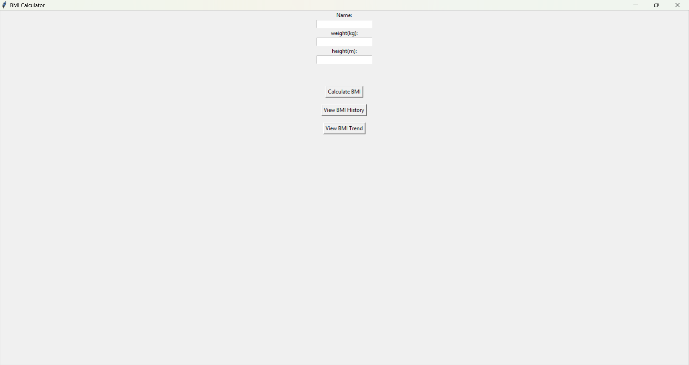
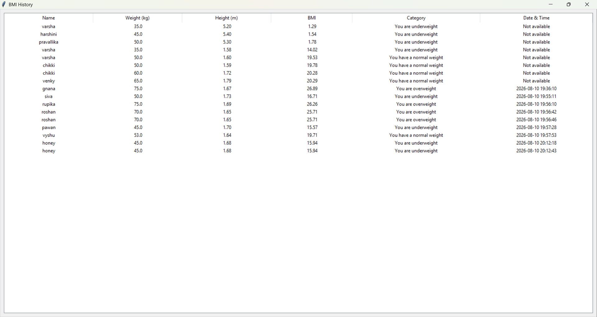
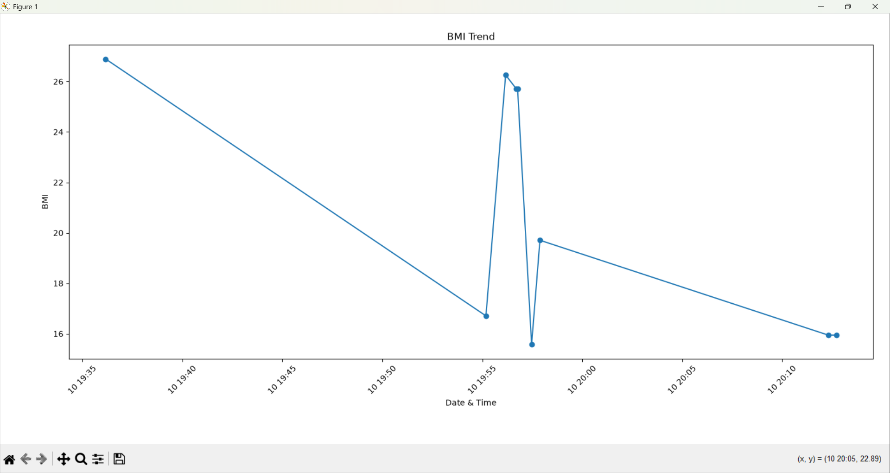

# Task 2 - BMI Calculator

## About the Project

This project is a BMI (Body Mass Index) Calculator developed using Python.

The application provides a graphical user interface using Tkinter. It calculates BMI based on the user's weight and height and displays the corresponding BMI category.

The application also stores BMI records in an SQLite database and allows users to view their previous BMI records with date and time. A BMI trend graph is also provided using Matplotlib.

## Features

-> User-friendly graphical interface
-> Enter name, weight, and height
-> BMI calculation
-> BMI category detection
-> Input validation
-> BMI history storage using SQLite
-> Date and time for each record
-> View previous BMI records
-> BMI trend graph
-> Data visualization using Matplotlib

## BMI Categories

BMI Range & Category 
Below 18.5   -> Underweight 
18.5 - 24.9  -> Normal Weight 
25 - 29.9    -> Overweight 
30 and above -> Obese 

## Technologies Used

-> Python
-> Tkinter
-> SQLite
-> Matplotlib
-> ttk
-> datetime

## Project Structure

```text
Task-2-BMI-Calculator/
│
├── bmi_calculator.py
├── bmi_history.db
├── README.md
└── screenshots/
    ├── bmi_working.png
    ├── bmi_history.png
    └── bmi_trend.png
```

## How to Run

1. Make sure Python is installed.
2. Install Matplotlib:

```text
pip install matplotlib
```
3. Run the program:

```text
python bmi_calculator.py
```
4. Enter your name, weight, and height.
5. Click Calculate BMI.
6. Click View BMI History to see your saved records.
7. Click View BMI Trend to see your BMI graph.

## Database:
The application uses SQLite to store:

* Name
* Weight
* Height
* BMI
* Category
* Date and Time

The database file is automatically created when the application runs.

## Screenshots:
### Calculator

### BMI History

### BMI Trend
